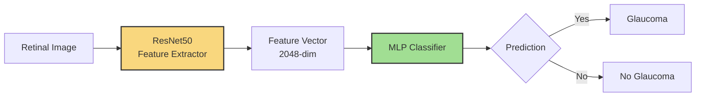
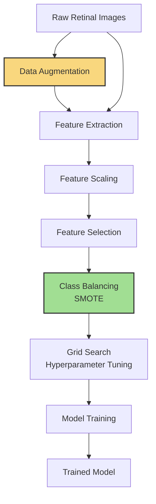

#  Glaucoma Detection System

A full-stack AI solution for detecting glaucoma from retinal fundus images, combining a powerful **FastAPI backend** with a user-friendly **Next.js frontend**.

---

## 📚 Table of Contents
1. Project Overview  
2. System Architecture  
3. Process Flow  
4. Folder Structure  
5. Quick Start  
6. More Details  
7. Contact  

---

## 🧩 Project Overview

This repository combines two key components:

- 🔧 `glaucoscan-API`: FastAPI-based backend for image processing and classification.  
- 🌐 `glaucoscan-UI`: Next.js frontend for uploading images, getting predictions, and user interaction.  

### Core Model Architecture



---

## 🔁 Process Flow



---
## 🗂️ Folder Structure

```
Glaucoma/
├── glaucoscan-API/     # Backend: FastAPI service
├── glaucoscan-UI/      # Frontend: Next.js application
├── README.md           # This file
```

Each subproject includes its own `README.md` with setup instructions, configuration options, and advanced usage.

---

## 🚀 Quick Start

### Backend (API)

```bash
cd glaucoscan-API
pip install -r requirements.txt
python app.py
# API docs: http://localhost:8236/docs
```

### Frontend (UI)

```bash
cd glaucoscan-UI
npm install
npm run dev
# Access app at http://localhost:3000
```

### Docker (Optional)

Each component has its own `run-docker.sh` script:

```bash
cd glaucoscan-API && ./run_docker.sh
cd glaucoscan-UI  && ./run-docker.sh
```

---

## 🔎 More Details

- 📘 **API Documentation**: See `glaucoscan-API/README.md`  
- 📘 **UI Documentation**: See `glaucoscan-UI/README.md`

---

## 📬 Contact

For questions or support, reach out at:

- **GitHub Issues**: https://github.com/KrishNachnani/Glaucoma/issues

---

## 🪪 License

This project is licensed under the MIT License.
