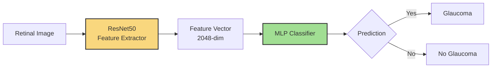
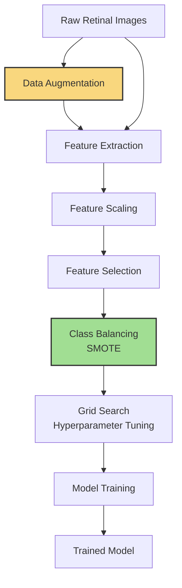

#  Glaucoma Detection System

# GlaucoScan.ai

**Open-source full stack AI tool for early glaucoma detection from fundus images, optimized for mobile and low-resource clinics.**


---

## ✨ Key Features

- 🔍 Glaucoma prediction using lightweight MLP architecture
- 🖼️ Supports fundus image upload via modern UI (Next.js)
- ⚙️ FastAPI backend with modular components for preprocessing, training, and inference
- 🧠 Energy-efficient model optimized for low-resource clinics
- 🐳 Docker-ready for fast deployment

---

## 🧪 Live Demo

Try it: [glaucoscan.ai](https://glaucoscan.ai)
Watch the video demo: [YouTube Link](https://youtu.be/c6hR0KTX86Q)


## 📚 Table of Contents
1. Project Overview  
2. System Architecture  
3. Process Flow  
4. Folder Structure  
5. Quick Start  
6. More Details  
7. Contact  

---

## 🧩 Project Overview

This repository combines two key components:

- 🔧 `glaucoscan-API`: FastAPI-based backend for image processing and classification.  
- 🌐 `glaucoscan-UI`: Next.js frontend for uploading images, getting predictions, and user interaction.  

### Core Model Architecture



---

## 🔁 Process Flow



---
## 🗂️ Folder Structure

```
Glaucoma/
├── glaucoscan-API/     # Backend: FastAPI service
├── glaucoscan-UI/      # Frontend: Next.js application
├── README.md           # This file
```

Each subproject includes its own `README.md` with setup instructions, configuration options, and advanced usage.

---

## 🚀 Quick Start

### Backend (API)

```bash
cd glaucoscan-API
pip install -r requirements.txt
python app.py
# API docs: http://localhost:8236/docs
```

### Frontend (UI)

```bash
cd glaucoscan-UI
npm install
npm run dev
# Access app at http://localhost:3000
```

### Docker (Optional)

Each component has its own `run-docker.sh` script:

```bash
cd glaucoscan-API && ./run_docker.sh
cd glaucoscan-UI  && ./run-docker.sh
```

---

## 🔎 More Details

- 📘 **API Documentation**: See `glaucoscan-API/README.md`  
- 📘 **UI Documentation**: See `glaucoscan-UI/README.md`

---

## 📬 Contact

For questions or support, reach out at:

- **GitHub Issues**: https://github.com/KrishNachnani/Glaucoma/issues

---

## 📝 Citation

If you use this work in your research, please cite the following papers:

1. **Energy Efficient Learning Algorithms for Glaucoma Diagnosis**  
   *Proceedings of the 22nd IEEE International Conference on Machine Learning and Applications (ICMLA 2023)*  
   Krish Nachnani  
   DOI: [10.1109/ICMLA58977.2023.00307](https://doi.org/10.1109/ICMLA58977.2023.00307)

2. **Leveraging GAN-based Data Augmentation for Advanced Glaucoma Diagnostics**  
   In *Recent Advances in Deep Learning Applications*, CRC Press, Taylor & Francis Group.  
   Krish Nachnani  
   [Available online](https://www.taylorfrancis.com/books/edit/10.1201/9781003570882/recent-advances-deep-learning-applications-uche-onyekpe-vasile-palade-arif-wani)

The second publication is an extended version of the ICMLA 2023 paper, with additional results and discussion.

---

## 🪪 License

This project is licensed under the MIT License.
