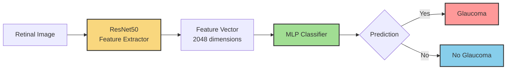
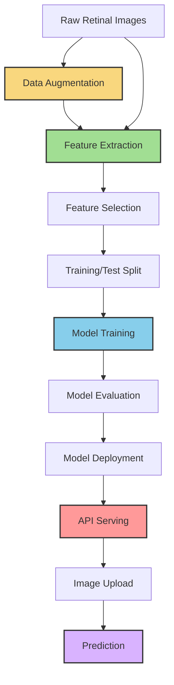
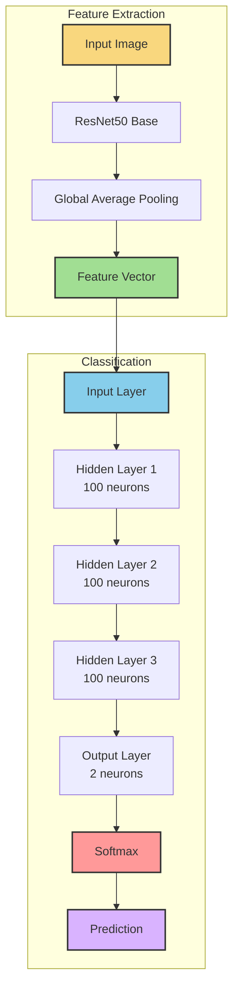
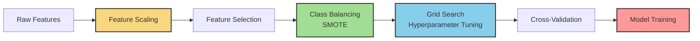
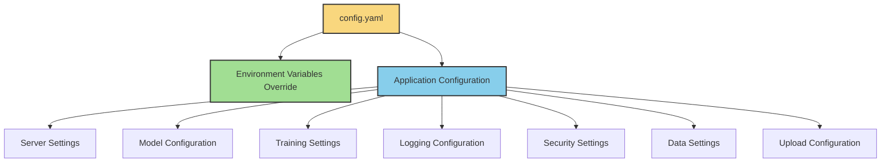
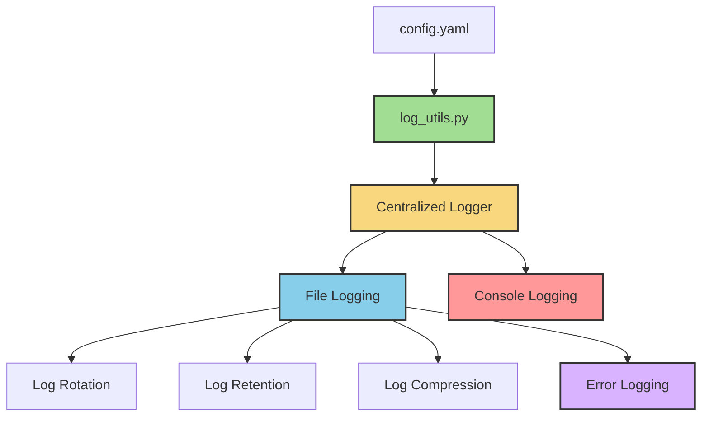

# Glaucoma Detection API
An API for detecting glaucoma from retinal images using deep learning and computer vision.

## Overview
This project provides a robust and efficient API for automated glaucoma detection from retinal fundus images. It uses a two-stage architecture:
1. A deep CNN feature extractor (ResNet50) to generate feature vectors from retinal images
2. A Multi-Layer Perceptron (MLP) classifier to determine if the image shows signs of glaucoma

The API is built with FastAPI, providing a modern, fast, and easy-to-use interface for deploying the glaucoma detection model.

## System Architecture


## Project Structure
```
├── app.py                 # Main FastAPI application
├── model_utils.py         # Utility functions for model operations
├── train_model.py         # Script to train and save the classification model
├── extract_features.py    # Script to extract features from images
├── augment_data.py        # Script for data augmentation
├── log_utils.py           # Centralized logging configuration utility
├── config.yaml            # Configuration file for application settings
├── requirements.txt       # Project dependencies
├── images/                # Directory for training/test images
│   ├── Balanced Glaucoma/     # Images with glaucoma
│   └── Balanced No Glaucoma/  # Images without glaucoma
├── models/                # Directory for storing trained models
├── logs/                  # Directory for application logs
└── uploaded/              # Directory for user-uploaded images
```

## Process Flow


## Installation
1. Clone the repository:
```bash
git clone <repository-url>
cd GluacomaAPI
```

2. Create a virtual environment:
```bash
python -m venv venv
source venv/bin/activate  # On Windows, use: venv\Scripts\activate
```

3. Install dependencies:
```bash
pip install -r requirements.txt
```

## Configuration
The application is fully config-driven using the `config.yaml` file. All aspects of the application can be configured through this single file, making it easy to adapt to different environments and requirements.

### Configuration Structure
The configuration is organized into logical sections:

```
config.yaml
├── environment        # Environment-specific settings
├── server             # Server configuration
├── app                # Application metadata
├── model              # Model parameters and paths
├── training           # Training settings
├── data               # Data locations and settings
├── upload             # Upload directory configuration
├── logging            # Log configuration
├── security           # Security settings
├── cache              # Caching options
└── monitoring         # Monitoring configuration
```

### Environment Variable Overrides
Any configuration value can be overridden using environment variables with the pattern:
```
GLAUCOMA_SECTION_KEY=value
```

For example:
- `GLAUCOMA_SERVER_PORT=8080` overrides the server.port setting
- `GLAUCOMA_LOGGING_LEVEL=DEBUG` sets logging level to DEBUG

This makes the application highly configurable across different deployment environments without changing the config.yaml file.

### Environment Modes
The application supports different environment modes:
- `development`: Enables features helpful for development (detailed errors, auto-reload)
- `testing`: Configured for running tests
- `production`: Optimized for production deployment with security features enabled

Set the mode in config.yaml or via environment variable:
```bash
export GLAUCOMA_ENVIRONMENT_MODE=production
```

### Key Configuration Options

#### Model Configuration
```yaml
model:
  img_size: [224, 224]
  confidence_threshold: 0.7
  feature_extraction:
    backbone: "resnet50"  # Options: resnet50, vgg16, efficientnet
    pooling: "avg"  # Options: avg, max, flatten
```

#### Training Configuration
```yaml
training:
  train_ratio: 0.8
  use_grid_search: true
  use_smote: true
  mlp_params:
    hidden_layer_sizes: [100, 100, 100]
    activation: "relu"
    max_iter: 200
```

#### Data Augmentation Settings
```yaml
data:
  augmentation:
    enabled: true
    factor: 5
    rotation_range: 20
    width_shift_range: 0.2
    # additional augmentation parameters...
```

#### Upload Configuration
```yaml
upload:
  directory: "uploaded"
  glaucoma_subfolder: "glaucoma"
  noglaucoma_subfolder: "noglaucoma"
  organize_by_prediction: true
```

#### Security Settings
```yaml
security:
  enable_cors: true
  allow_origins: ["*"]  # Restrict in production
  enable_rate_limiting: false
  enable_api_key: false
```

### Logging Configuration
The application uses loguru for advanced logging capabilities. You can configure:
- Log levels (`DEBUG`, `INFO`, `WARNING`, `ERROR`, `CRITICAL`)
- Log format and styling
- File rotation settings (size-based rotation)
- Log retention policies
- Console logging options
- Separate error logging

```yaml
logging:
  level: "INFO"
  format: "<green>{time:YYYY-MM-DD HH:mm:ss}</green> | <level>{level: <8}</level> | <cyan>{name}</cyan>:<cyan>{function}</cyan>:<cyan>{line}</cyan> - <level>{message}</level>"
  file_path: "logs/glaucoma_api.log"
  error_log_path: "logs/error.log"
  rotation: "10 MB"
  retention: "1 month"
  compression: "zip"
  console: true
  backtrace: true
  access_log: true
```

## Usage
### Data Augmentation
To increase your training dataset size and improve model accuracy:
```bash
python augment_data.py --images-dir /path/to/your/images --factor 5
```

Options:
- `--images-dir`: Directory containing image subdirectories (default: ./images)
- `--output-dir`: Directory to save augmented images (optional)
- `--factor`: Number of augmented images to generate per original (default: 5)
- `--config`: Path to config file (default: config.yaml)

### Extracting Features from Images
To extract features from your retinal images without training a model:
```bash
python extract_features.py --images-dir /path/to/your/images
```

Options:
- `--images-dir`: Directory containing image subdirectories (default: ./images)
- `--output-file`: Path to save the featurized data CSV (default: featurized_data.csv)
- `--class-dirs`: Specific class directories to process (optional)
- `--config`: Path to config file (default: config.yaml)
- `--backbone`: Feature extraction model backbone (default: from config)

### Training the Model
To train the classification model using features extracted from your images:
```bash
python train_model.py --extract --images-dir /path/to/your/images
```

Enhanced training options:
- `--extract`: Extract features from images before training
- `--images-dir`: Directory containing image subdirectories (default: ./images)
- `--train-ratio`: Ratio of data to use for training (default: from config)
- `--no-grid-search`: Disable grid search for faster training
- `--no-smote`: Disable SMOTE class balancing
- `--no-feature-selection`: Disable feature selection
- `--max-iter`: Maximum number of iterations for the MLP (default: from config)
- `--config`: Path to config file (default: config.yaml)

### Running the API
Start the API server:
```bash
python app.py
```

Or using uvicorn directly:
```bash
uvicorn app:app --host 0.0.0.0 --port 8001 --reload
```

You can override configuration with environment variables:
```bash
GLAUCOMA_SERVER_PORT=9000 GLAUCOMA_LOGGING_LEVEL=DEBUG python app.py
```

Once running, you can:
- Access the API documentation at http://localhost:8001/docs
- Test the API by uploading retinal images

## API Endpoints
- `GET /`: Health check endpoint
- `POST /upload/`: Upload a single image and get features and prediction
- `POST /batch-upload/`: Upload multiple images and get features and predictions for each

## Model Architecture


The system uses a 2-stage architecture:
1. **Feature Extraction**: ResNet50 pretrained on ImageNet is used to extract 2048 deep features from each retinal image.
2. **Classification**: A Multi-Layer Perceptron (MLP) with three hidden layers (100, 100, 100) classifies the extracted features as "Glaucoma" or "No Glaucoma".

## Improvement Methods
The training process includes several techniques to improve model accuracy:


1. **Feature Scaling**: Standardizes features to have mean=0 and variance=1
2. **Feature Selection**: Uses Random Forest to identify the most important features
3. **Class Balancing (SMOTE)**: Generates synthetic samples for minority class
4. **Grid Search**: Finds optimal hyperparameters for the model
5. **Cross-Validation**: Ensures model robustness

## Config-Driven Architecture
The application follows a config-driven architecture pattern:



Benefits:
- **Single Source of Truth**: All configuration in one place
- **Environment-Specific Overrides**: Easy deployment across environments
- **No Hardcoded Values**: All parameters are configurable
- **Self-Documented**: Config file documents available options
- **Centralized Control**: Change behavior without code modifications

## Logging System
The application includes a comprehensive logging system based on the `loguru` library:


Features:
- **Centralized Configuration**: All logging settings are managed in a single `config.yaml` file
- **Structured Logs**: Well-formatted logs with timestamps, levels, and source information
- **Log Rotation**: Automatically rotates logs based on file size
- **Log Retention**: Controls how long logs are kept before deletion
- **Colored Output**: Enhanced readability with color-coded console output
- **Multi-destination Logging**: Simultaneously logs to files and console
- **Contextual Information**: Automatically includes file, function, and line number in log messages
- **Separate Error Logging**: Dedicated error log file

## Dataset
The system is designed to work with retinal fundus images. The included sample dataset contains:
- Balanced Glaucoma: 45 images
- Balanced No Glaucoma: 27 images

For production use, it's recommended to train with a larger, balanced dataset. The data augmentation feature can help increase your dataset size.

## Performance
The enhanced MLP model typically achieves accuracy between 90-98% on balanced test sets, depending on the quality and size of the training data.

The training process automatically generates performance metrics including:
- Accuracy score
- Classification report (precision, recall, F1-score)
- Confusion matrix visualization

## License
[Include your license information here]

## Contact
[Your contact information]